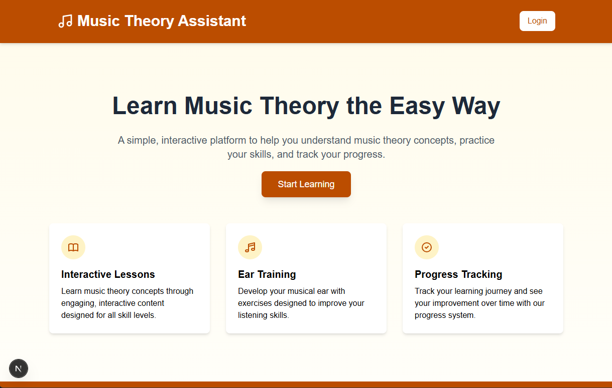
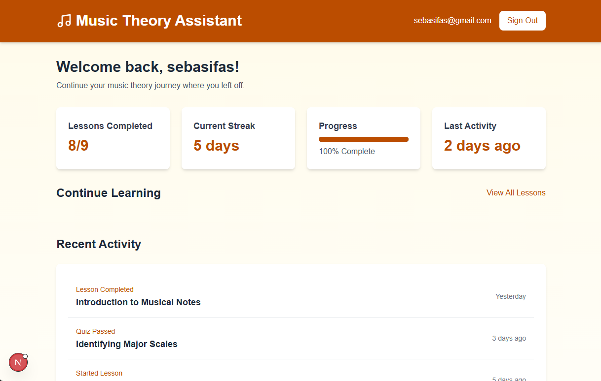
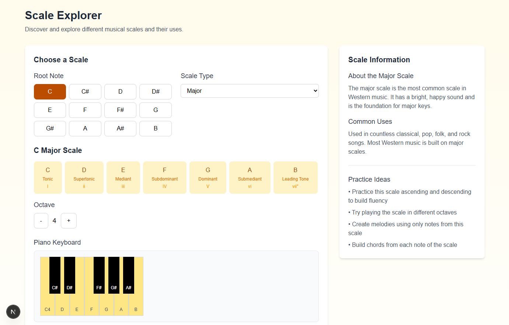
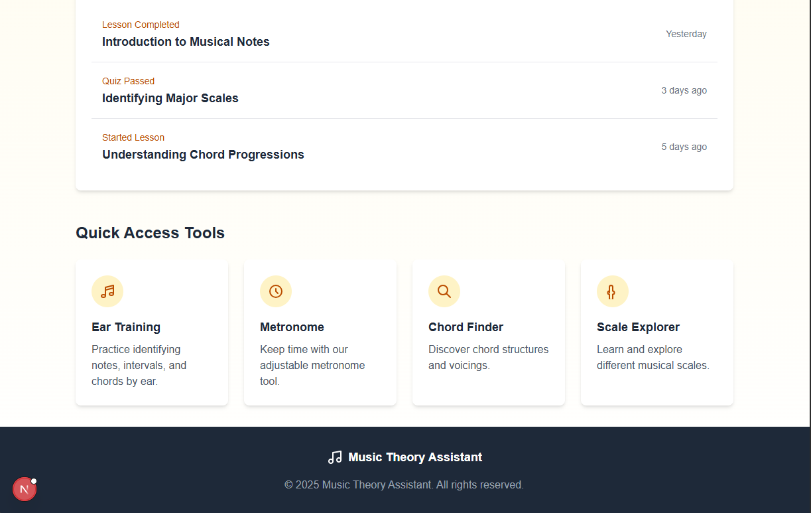

# Music Theory Assistant

A comprehensive learning platform for music theory with interactive tools and structured lessons.




## About

Music Theory Assistant helps users learn music theory through interactive lessons, quizzes, and practical tools. Perfect for beginners wanting to understand music fundamentals or intermediate students looking to deepen their knowledge.

## Features

### Interactive Learning

- **Structured Lessons**: Progressive courses covering music notation, rhythm, scales, and harmony
- **Interactive Quizzes**: Test your knowledge with immediate feedback
- **Progress Tracking**: Monitor your learning journey with completion statistics



### Practical Tools

- **Chord Finder**: Explore chord structures and hear how they sound
- **Ear Training**: Develop your ability to identify intervals, chords, and scales by ear
- **Metronome**: Practice with a precise, adjustable beat keeper
- **Scale Explorer**: Discover and learn scales with interactive visualization



## Tech Stack

- **Frontend**: Next.js, React, TypeScript, Tailwind CSS
- **Backend**: Supabase (PostgreSQL)
- **Authentication**: Supabase Auth
- **Audio**: Tone.js
- **Desktop**: Electron (optional)

## Getting Started

### Prerequisites

- Node.js (v14+)
- npm or yarn
- Supabase account (or other PostgreSQL database)

### Installation

1. Clone the repository
```bash
git clone https://github.com/yourusername/music-theory-assistant.git
cd music-theory-assistant
```

2. Install dependencies
```bash
npm install
# or
yarn install
```

3. Set up environment variables
```
# Create a .env.local file with:
DATABASE_URL=your_supabase_connection_string
NEXT_PUBLIC_SUPABASE_URL=your_supabase_project_url
NEXT_PUBLIC_SUPABASE_ANON_KEY=your_supabase_anon_key
```

4. Run database migrations
```bash
npx prisma migrate dev
```

5. Start the development server
```bash
npm run dev
# or
yarn dev
```

6. (Optional) Run as Electron app
```bash
npm run electron:dev
# or
yarn electron:dev
```

## Account Creation

Users create accounts through the web application. The registration process requires:

1. Email address
2. Password
3. Email verification (confirmation link sent to provided email)

Once verified, users can access all features and track their progress across devices.

## Project Structure

```
music-theory-assistant/
├── src/
│   ├── app/                   # Next.js pages and routes
│   ├── components/            # Reusable UI components
│   │   ├── layout/            # Layout components
│   │   ├── ui/                # UI elements
│   │   └── music/             # Music-specific components
│   └── lib/                   # Utility functions and services
├── prisma/                    # Database schema and migrations
├── public/                    # Static assets
└── electron/                  # Electron configuration (optional)
```

## Audio Features

The application uses Tone.js to provide high-quality audio playback for:

- Piano keyboard visualization
- Chord and scale playback
- Ear training exercises
- Metronome functionality

## Educational Content

Lessons are structured around fundamental music theory concepts:

1. **Music Basics**
   - Music notation
   - Rhythm and time signatures
   
2. **Scales and Keys**
   - Major and minor scales
   - Modes and exotic scales
   
3. **Harmony**
   - Chord construction
   - Chord progressions

## Responsive Design

The application is fully responsive and works across devices:

- Desktop (optimized for learning)
- Tablet (great for practice sessions)
- Mobile (convenient for quick reference)

## Roadmap

- More advanced lessons (counterpoint, composition)
- Social features (share progress, challenges)
- MIDI keyboard integration
- Custom exercise creator

## Acknowledgments

- Tone.js for audio capabilities
- Music theory educational resources that inspired the content